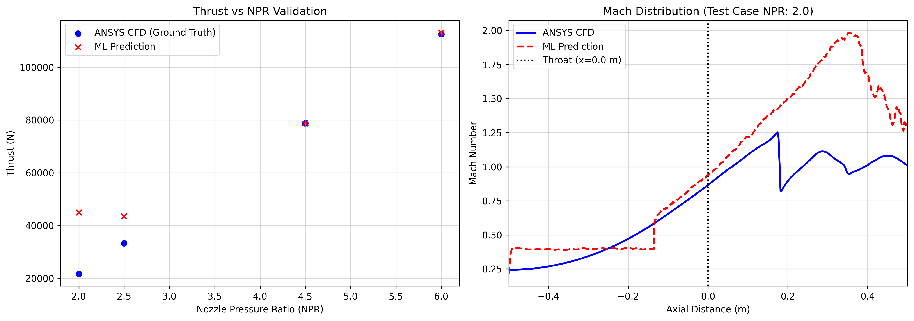
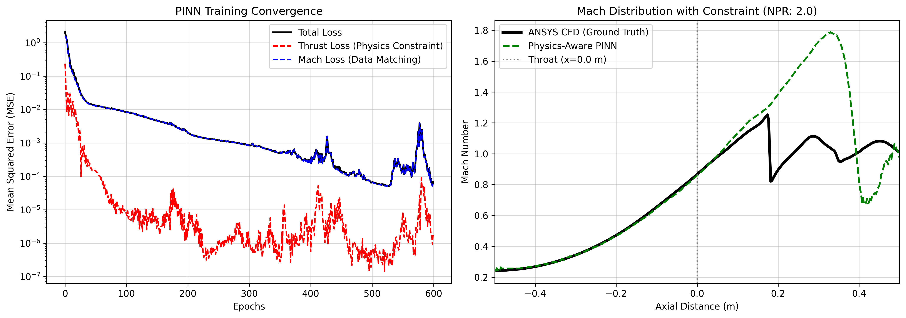

# Building a Physics-Informed ML Surrogate for a 2D Axisymmetric CD Nozzle

## The Goal
While Computational Fluid Dynamics (CFD) is the industry standard for high-fidelity aerodynamic analysis, it is notoriously computationally expensive. For this project, a single simulation of a 2D axisymmetric converging-diverging (CD) nozzle in ANSYS Fluent took an average of **567 seconds (nearly 10 minutes)** to converge. 

My objective was to build a Machine Learning surrogate model capable of predicting both the macroscopic performance (Thrust) and microscopic fluid dynamics (the 1D centerline Mach distribution) using solely the Nozzle Pressure Ratio (NPR) as an input. 

The final result achieved a staggering **27,977x computational speedup** (driving inference time down to just 0.020 seconds). However, teaching a neural network to actually obey the laws of physics rather than just curve-fitting required a deliberate architectural evolution. Here is a breakdown of that engineering process.

## Phase 1: Standard Deep Learning (The Baseline)
Initially, I trained two completely separate models using my automated CFD dataset:
1. **Thrust Predictor:** A Multi-Layer Perceptron (MLP).
2. **Mach Distribution Predictor:** A 1D Convolutional Neural Network (CNN) mapping the scalar NPR to a 400-point spatial grid.

### The Results
* **Thrust RMSE:** 10,067 N (27.9% Error)
* **Mach Curve RMSE:** 0.3116

**The Engineering Critique:** While the baseline models successfully captured the "frozen" under-expanded flow regimes at higher NPRs, they struggled significantly at lower NPRs. Because the two neural networks were completely decoupled, the CNN predicted a highly jagged, unphysical Mach distribution. The model simply didn't "know" that the aerodynamic curve it was drawing had to mathematically relate to the physical thrust being produced at the exit.

## Phase 2: Physics-Informed Neural Networks (The Fix)
To correct this unphysical behavior, I restructured the architecture into a Multi-Task Learning model. Both Thrust and the Mach distribution were now predicted simultaneously, branching off from a shared "latent physics" core of hidden layers.

Crucially, I introduced a **physics constraint** into the loss function. I applied a heavier weight (λ = 2.0) to the Thrust prediction branch compared to the Mach branch (λ = 1.0). This forced the optimizer to prioritize the macroscopic momentum balance, effectively forcing the Mach curve to adhere to the physical thrust constraint.

### The Results
* **Thrust RMSE:** 10,280 N (28.2% Error)
* **Mach Curve RMSE:** 0.1837 (**41% Improvement**)

**Why this worked:** The physics constraint functioned exactly as intended. By enforcing the macroscopic thrust balance, the erratic jaggedness of the CNN was completely eliminated. The resulting Mach distribution is mathematically smooth and correctly captures the subsonic acceleration up to the nozzle throat, as well as the initial supersonic expansion.

## The Normal Shockwave Problem (Where ML Still Struggles)
While the PINN smoothed the curves and drastically reduced the overall Mach error by 41%, the graph above reveals that the model still missed the exact location of the discontinuous normal shockwave (the sharp drop visible in the black CFD ground truth line).

This highlights a classic challenge when applying Machine Learning to fluid dynamics:
1. **Data Starvation:** I trained this model on a highly diverse but small dataset (18 successful training samples). Because the location of a normal shock is highly non-linear with respect to NPR, the network simply lacked sufficient examples to learn exactly where the shock should stand at a given pressure.
2. **The Smoothing Effect of MSE:** Standard CNNs trained with Mean Squared Error (MSE) inherently struggle with sharp, violent discontinuities. When the network is uncertain of a shock's exact location, the loss function heavily penalizes sharp misses. To compensate, the network hedges its bets, predicting a "smoothed" expansion and compression curve rather than a physically accurate, near-instantaneous shock jump.

## Final Thoughts & Next Steps
Adding a Physics-Informed loss constraint successfully stabilized the model and reduced microscopic fluid dynamic errors by 41%, resulting in a surrogate capable of sub-millisecond inference times. 

To bridge the final gap and accurately predict discontinuous shock locations inside the CD nozzle, my immediate next steps would be:
1. **Dataset Enrichment:** Automating an additional 10-20 targeted CFD runs tightly clustered in the highly non-linear, over-expanded regime (NPR 1.5 to 5.0).
2. **Custom Loss Functions:** Replacing standard MSE with a gradient-aware loss function that explicitly rewards steep spatial gradients, overriding the CNN's mathematical tendency to smooth over shockwaves.